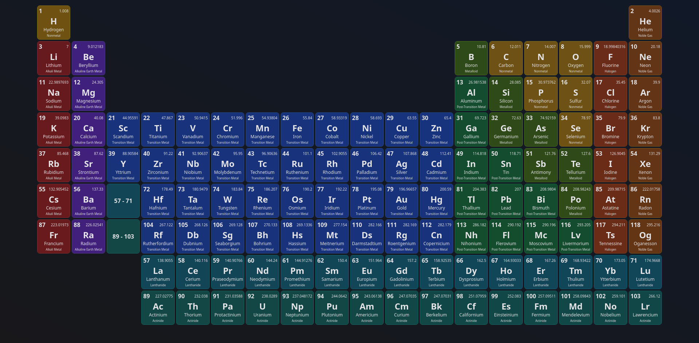

<h1 align="center">
  🧪 Atomix
</h1>

  Interactive periodic table of elements

<h4 align="center">
  
  
</h4>

## Roadmap

- [X] Table of elements with sleek UI
- [X] Modal with element details
- [ ] Color-coded filters
  - [X] Category (Chemical Group)
  - [X] Phase
  - [X] Electron Configuration
  - [ ] Oxidation States
  - [ ] Electronegativity (Pauling Scale)
  - [ ] Atomic Radius (Van der Waals), pm
  - [ ] Melting Point, $K$
  - [ ] Boiling Point, $K$
  - [ ] Density, $g/cm^3$
- [ ] Legend for element labels for each filter
- [ ] Bohr Atoms visualization
- [ ] Molecules sandbox & visualization
  - Not sure where I want to go with this idea, but it would be cool to experiment with metal alloys and learn about their properties
